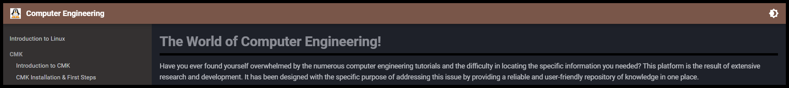

The objective of this project is to enhance the user experience of building a website based on markdown files. This is achieved through the use of a docker image, which has all the necessary software packages preinstalled.

Further details regarding the usage of this template can be found at [https://www.ans.co.at](https://www.ans.co.at/writing/mkdocs/TMPL_MMDOCs/).